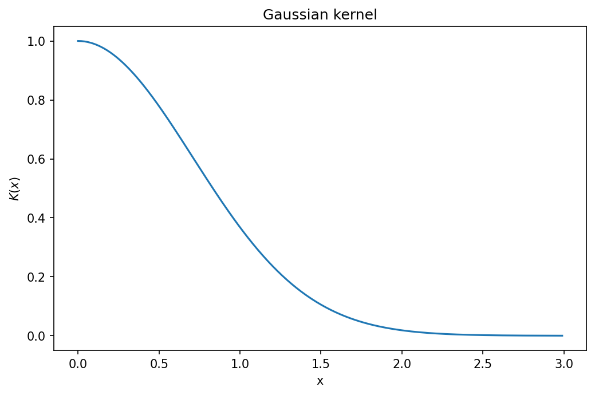
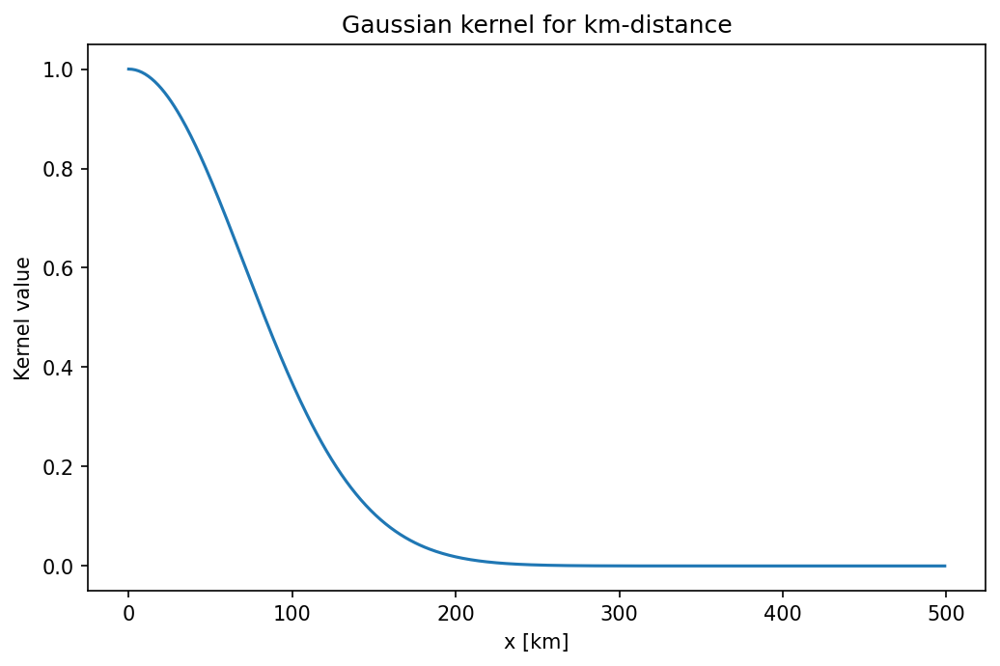
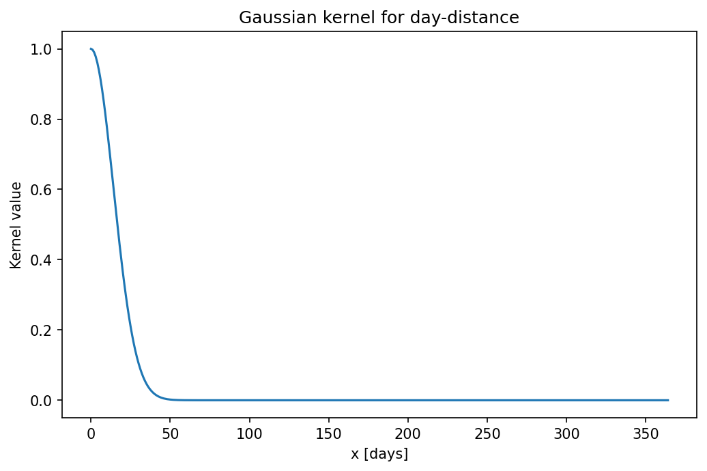
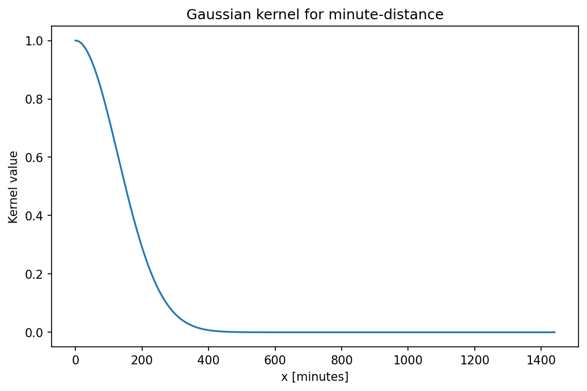
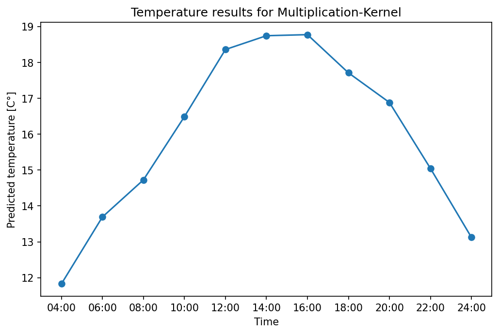

# Assignment BDA3 - Machine Learning

* Assignment BDA3 can be found on the [Labs page of the course Website](https://www.ida.liu.se/~732A54/lab/index.en.shtml)
* Include *source code* for the assignment in this directory.
* Include a *PDF* report for the assignment in this directory.
* Use *Spark and Python*. *Do not use Spark SQL or any other programming languages*.
* Grant Maintainer access to your repository to *jose.m.pena@liu.se* and send him a link to the repository when the assignment is complete.

Hand in a lab report that includes the name and LiU ID of each group member.
Include your code, results from the code execution, and written answers to the questions in the assignment. Comment each step in your program to provide a clear picture of your reasoning when solving the assignment.

---

# Report

## Members

* Patrick Siegfried Hiemsch (pathi619)
* Maximilian Merz (maxme107)

## Source Code:

The source code can be found in the [implementation.py](implementation.py) file.

## OUTPUT:

| Time         | Summed up kernels  | Product of kernels |
|--------------|-----------|------------|
| 24:00:00 | 7.922944304141119 | 13.124808393759198 |
| 22:00:00 | 8.295522387522821 | 15.04680283007517  |
| 20:00:00 | 8.268775329052499 | 16.883093398328768 |
| 18:00:00 | 8.139132058184966 | 17.70896840165911  |
| 16:00:00 | 9.151619938049954 | 18.7728541733717   |
| 14:00:00 | 9.090391559536018 | 18.743215581223236 |
| 12:00:00 | 8.629918952343134 | 18.358435745129935 |
| 10:00:00 | 8.456424266593087 | 16.489179178473744 |
| 08:00:00 | 7.663123175375569 | 14.727321405053369 |
| 06:00:00 | 6.901596519174886 | 13.693843810711043 |
| 04:00:00 | 7.784375541363991 | 11.830753508772254 |

## Questions:

### 1. Show that your choice for the kernels’ width is sensible, i.e. it gives more weight to closer points. Discuss why your definition of closeness is reasonable.

The value for h will define, how much weight will be given to distances in the different measurement units by the kernel function. In general the Gaussian Kernel function for values >= 0 looks as follows:

<!--  -->

From here we can see that the value of the kernel around h, which in this general case is just 1, is approximately 0.3. After that, the kernel value decreases and approaches 0 asymptotically. 

In the following we will show our chosen values for h for the three features km-distance, day-distance and time-of-day-distance:

#### km-distance
For the km-distance, we chose a value of 100km, so all cities with a distance to the target city of less than 100km will receive a kernel value for this feature that is higher than 0.3. The ones that are further away than 100km will receive very low weightings (kernel values of >200km are very close to 0). This is illustrated in the following plot:

#### day-distance
For the day-distance we chose h=20, so that the measurements from around one month are taken into account and days further away get a weight of approximately 0. Here is the plot for the kernel function:

#### time-of-day-distance
The time-of-day-distance is measured in minutes in our model and we chose an h value of 180, leading to the assignment of low weights for temperature measurements that are more than 3 hours away from the prediction time. Here is the plot for the kernel function:

### 2.  Repeat the exercise using a kernel that is the product of the three Gaussian kernels above. Compare the results with those obtained for the additive kernel. If they differ, explain why.

##### Results of the summation kernel

The following plot shows the results of the kernel model using the sum of kernels as weights for 2013-07-04 at the location provided in the exercise:

##### Results of the multiplication kernel

The following plot shows the results of the kernel model using the multiplicaiton of kernels as weights for the same date and location:

The results are pretty different especially in terms of the range of the temperature. In the multiplication case we get temperatures that are a lot higher (around 7-9 degrees) whereas we observe values in the range of 12 to 19 degrees for the multiplication. The latter seem more reasonable for the given location in July, which also makes sense if we look at the model structure: Essentially what the kernel models are computing is a weighted average over all temperature measurements in the dataset (all locations, times, days). The weight is either calculated as the sum of the individual kernels or their multiplication. In case of summing, measurtements that are very different in one of the feature dimensions still get a pretty high weight if they are close in the other feature dimensions. So the measurement of a place very far away (kernel value = 0) from the same day and same time as the point to predict (both kernels = 1), will still get a (high) positive weight.  So this measurement would still have an influence on the prediction, even though it does not make sense to include it. In case of the multiplication, measurements that are very different in one direction, get assigned a weighting value of approximately 0, so their mesurements will have no effect on the prediction. This is the reason why we see such differences in predictions (the prediction of the summation kernel is influenced by places very far in the north with a lot colder temperatures).
