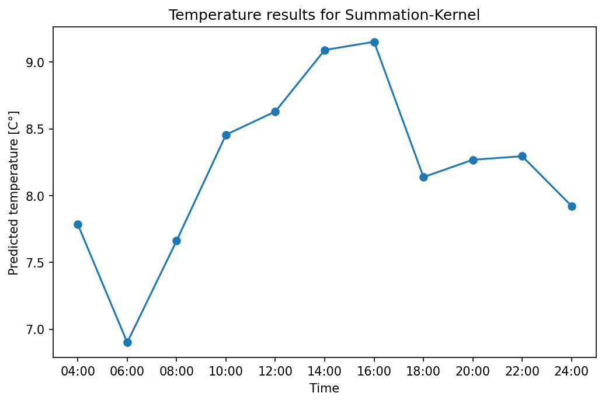

# Kernel Regression for Temperature Prediction using PySpark

As part of the course Big Data Analytics at LiU, we had to implement a Kernel Regression Model in PySpark to predict the hourly temperatures for a certain date and location in Sweden based on historical data. The final model was run in parallel on the HPC cluster from the National Supercomputer Centre in Linköping, to showcase the power of parallelized computations on a Hadoop Distributed File System (HDFS) with PySpark for machine learning usecases on datasets that are far too big to fit in memory. 

The used dataset contains hourly temperature measurements from over 800 weather stations all over Sweden over multiple years. Since the size of the csv-file is > 2 GB, there is only a small example file in the data folder, showing the structure of the data. This is why the results presented here cannot be replicated with this repo alone. 

The data has the following structure:

|Station number| Date| Time| Air temperature (in °C) |Quality|
|--------------|-----|-----|-------------------------|-------|

## Kernel-Regression-Model

As stated above, the model that should be used for predicting the temperature for a certain day, hour and location in Sweden, is a Kernel Regression. So the predicted temperature will be a weighted average of all historical temperature measurements. The weight of this average is determined by a Kernel function, which assigns a weight to each historical data point depending on the distance from this historical point $x_n$ to the point to predict $x_p$:
$$y(x_{p})=\frac{\sum_{n} K\left(\frac{x_{n}-x_{p}}{h}\right) y_{n}}{\sum_{n} K\left(\frac{x_{n}-x_{p}}{h}\right)}$$

In this specific usecase, the Kernel-function is a sum of three Gaussian-kernels, each one representing a weight for the distance in one of the three following dimensions:
1. Distance in km (from measutement station to location to predict)
2. Day-distance (how many days difference between historic measurement and to predict, max. 364)
3. Hour-distance (how many hours difference between historic and to predict, max 1439)

The final prediction is calculated either as the sum or the product of all individual Kernels:
$$K_{\text{total}}(x_p, x_n) = K_{\text{km}}(x_p, x_n) + K_{\text{days}}(x_p, x_n) + K_{\text{hours}}(x_p, x_n)$$
or
$$K_{\text{total}}(x_p, x_n) = K_{\text{km}}(x_p, x_n) \cdot K_{\text{days}}(x_p, x_n) \cdot K_{\text{hours}}(x_p, x_n),$$
where each of the three Kernels is computed as follows (example for days-Kernel):
$$K_{\text{days}}(x_p, x_n) = \exp\left(-(\frac{|x_n^{(\text{days})}-x_p^{(\text{days})}|}{h^{(\text{days})}})^2\right).$$

This function resembles a PDF of the Gaussian Normal Distribution (e.g. without normalizing constant), where the difference from the mean is replaced by the Euclidean Distance of the two points in the respective dimension and the smoothing parameter $h$ takes the role of the standard deviation.

Using the individual Kernel weigths of all historical data points, we can calculate the predicted temperature as follows:
$$y(x_p)=\frac{\sum_{n} K_{\text{total}}(x_p, x_n) \cdot y_{n}}{\sum_{n} K_{\text{total}}(x_p, x_n)}$$

### Define values for parameter $h$

Before applying the model, reasonable values for the smoothing parameters $h$ need to be defined.

The value for h will define, how much weight will be given to distances in the different measurement units by the kernel function. In general the Gaussian Kernel function for values >= 0 looks as follows:

<!--  -->

From here we can see that the value of the kernel around h, which in this general case is just 1, is approximately 0.3. After that, the kernel value decreases and approaches 0 asymptotically. 

In the following we will show our chosen values for h for the three features km-distance, day-distance and time-of-day-distance:

#### 1. km-distance
For the km-distance, we chose a value of 100km, so all cities with a distance to the target city of less than 100km will receive a kernel value for this feature that is higher than 0.3. The ones that are further away than 100km will receive very low weightings (kernel values of >200km are very close to 0). This is illustrated in the following plot:

#### 2. day-distance
For the day-distance we chose h=20, so that the measurements from around one month are taken into account and days further away get a weight of approximately 0. Here is the plot for the kernel function:

#### 3. time-of-day-distance
The time-of-day-distance is measured in minutes in our model and we chose an h value of 180, leading to the assignment of low weights for temperature measurements that are more than 3 hours away from the prediction time. Here is the plot for the kernel function:

## Source Code

The source code can be found in the [implementation.py](implementation.py) file.

## Results

The output from HDFS looked as follows:

| Time         | Summed up kernels  | Product of kernels |
|--------------|-----------|------------|
| 24:00:00 | 7.922944304141119 | 13.124808393759198 |
| 22:00:00 | 8.295522387522821 | 15.04680283007517  |
| 20:00:00 | 8.268775329052499 | 16.883093398328768 |
| 18:00:00 | 8.139132058184966 | 17.70896840165911  |
| 16:00:00 | 9.151619938049954 | 18.7728541733717   |
| 14:00:00 | 9.090391559536018 | 18.743215581223236 |
| 12:00:00 | 8.629918952343134 | 18.358435745129935 |
| 10:00:00 | 8.456424266593087 | 16.489179178473744 |
| 08:00:00 | 7.663123175375569 | 14.727321405053369 |
| 06:00:00 | 6.901596519174886 | 13.693843810711043 |
| 04:00:00 | 7.784375541363991 | 11.830753508772254 |

### Results of the summation kernel

The following plot shows the results of the kernel model using the sum of kernels as weights for 2013-07-04 at the location provided in the exercise:

### Results of the multiplication kernel

The following plot shows the results of the kernel model using the multiplicaiton of kernels as weights for the same date and location:

The results are pretty different especially in terms of the range of the temperature. In the multiplication case we get temperatures that are a lot higher (around 7-9 degrees) whereas we observe values in the range of 12 to 19 degrees for the multiplication. The latter seem more reasonable for the given location close to Linköping in  July, which also makes sense if we look at the model structure: 

Essentially what the kernel models are computing is a weighted average over all temperature measurements in the dataset (all locations, times, days). The weight is either calculated as the sum of the individual kernels or their multiplication. 

In case of summing, measurtements that are very different in one of the feature dimensions still get a pretty high weight if they are close in the other feature dimensions. So the measurement of a place very far away (kernel value = 0) from the same day and same time as the point to predict (both kernels = 1), will still get a (high) positive weight.  So this measurement would still have a significant influence on the prediction, even though it does not make sense to include it at all (should have weight close to 0). 

In case of the multiplication, measurements that are very different in one direction, get assigned a total weighting value of approximately 0, so their measurements will have no (only minor) effect on the prediction. This is the reason why we see such differences in predictions (the prediction of the summation kernel is influenced by places very far in the north with a lot colder temperatures).

Summarizing, for this specific usecase, the multiplication Kernel-model is more suitable and shows overall good results. The smoothing parameters could be further tweaked to get even better results. 
